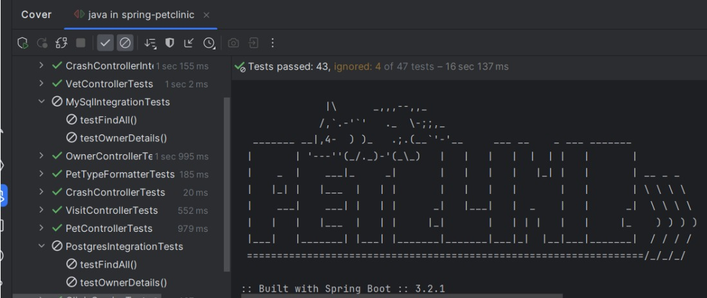
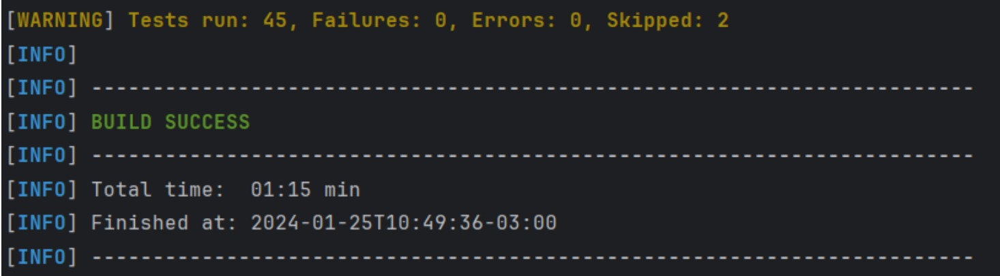
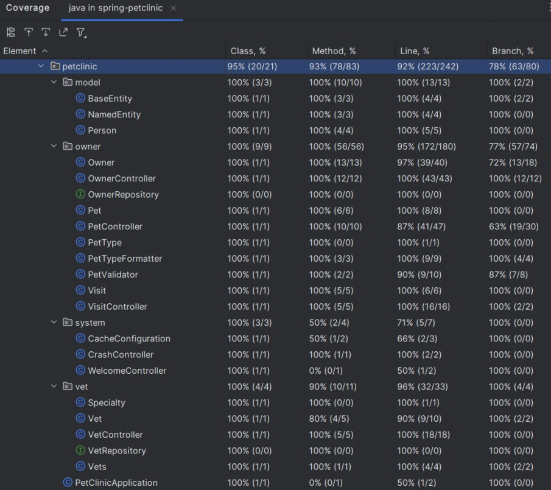

# Relatório da cobertura de testes do repositório original

## Resultados da ferramenta do IntelliJ

O primeiro teste de cobertura do IntelliJ mostrou que houveram **4 funções** que foram ignoradas. Isso aconteceu pela falta da presença do docker. Essas funções pertencem as classes que lidam com a integração com o **PostgreSQL** e a integração com o **MySQL**, sendo 2 funções ignoradas em cada classe:

O mesmo pode ser observado com relação ao teste feito pelo Maven, com o comando `mvn test`:

Por fim, temos os resultados de cobertura abaixo, considerando as classes e métodos do projeto e as métricas referentes ao Line Coverage e ao Branch Coverage

O intuito é estudar e contribuir ao código, adicionando funcionalidades e aumentando a cobertura de testes.
