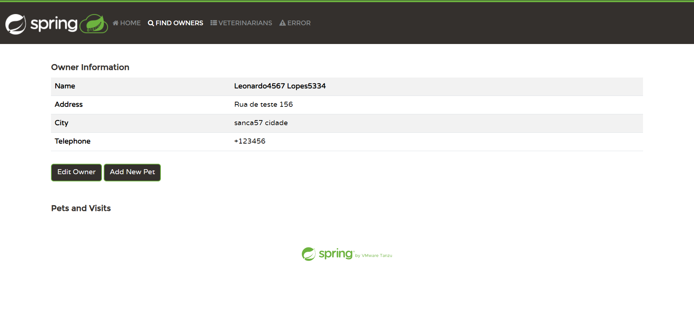

# Relatório dos testes manuais da GUI do código original

## Funcionalidades

A aplicação consiste numa clínica veterinária para animais de estimação. As funcionalidades até o momento são bem
simples, envolvendo quatro abas diferentes: **Home**, **Find Owners**, **Veterinarians** e
**Error**.

### Aba 'Home'

A página inicial (**Home**) é exibida inicialmente ao acessar a aplicação na porta 8080 localmente:

Com relação a esta página, não há muito o que testar.

### Aba 'Find Owners'

Seguimos para a próxima aba, com a funcionalidade
de encontrar um determinado dono de um ou mais animais de estimação.
Um primeiro teste irá testar o botão de encontrar um dono sem digitar nada no ‘input’ do nome:

Nota-se que no caso acima, os desenvolvedores optaram por exibir uma lista de donos fixa apenas para exemplo.

Podemos, de forma similar, testar a pesquisa por um dono sendo uma ‘string’ que contém apenas espaços em branco:

O resultado aparece diretamente abaixo do ‘input’, dizendo que nenhum usuário foi encontrado. Neste caso está tudo correto,
pois aqui testamos o caso de uma entrada qualquer do usuário, em vez de uma lista padrão para a falta de entrada.

Seguindo para a funcionalidade referente à adição de um novo dono de animal de estimação, podemos começar
testando com todos os campos vazios:

Há uma validação para cada um dos campos neste caso. Podemos testar na sequência, se os campos que deveriam conter
primariamente apenas letras (como os de nome e sobrenome) e o que deveria conter apenas números (telefone) possuem alguma
validação nesse sentido:

Neste caso, recebemos uma reclamação apenas do campo do telefone, onde aparece uma mensagem que parece mais um 'debug'
de código, com uma tradução bem estranha para o português. A entrada para o telefone aceita apenas valores numéricos e
que sejam de 1 a 10 números (não incluem o DDD, por exemplo).

Após alguns testes, observou-se que a entrada do telefone permite os sinais de '+' e '-' com o máximo de 10 números.
Então, testando um valor de exemplo com o '+' e 5 dígitos numéricos, mantendo os valores dos outros campos, temos:

Após alguns testes, verificamos que a funcionalidade de atualizar um dono existente possui coerentemente as mesmas validações
consideradas para o formulário de adição de um novo dono.

Passando agora para a funcionalidade de adicionar um novo animal de estimação a um determinado dono, começamos com o teste
para um formulário em branco:

Há uma informação retornada de que os campos são obrigatórios. Mesmo colocando o nome do 'pet' como uma 'string' vazia,
a mesma mensagem é exibida.

Testando agora uma data de nascimento que esteja no futuro:

Recebemos corretamente um aviso de que a data selecionada é inválida.
Colocando, por exemplo, um dos valores mais baixos para o campo da data de nascimento, temos o retorno:

Após alguns testes, constatou-se que o funcionamente de atualização dos pets possui as mesmas validações da criação.
Na sequência, verificou-se também no formulário de adição de visitas que o campo da descrição não pode ser vazio. No entanto,
o campo da data agora permite valores futuros (agendamento de visitas).

Após adicionar uma nova visita com uma descrição sucinta de um único caractere, e clicando novamente para adicionar uma
nova visita, podemos observar que a visita marcada fica salva no histórico de visitas daquele conjunto ('pet' e dono):

Vale ressaltar que os nomes de donos já colocados previamente pelos desenvolvedores aparecem na lista de donos (tal como
o novo dono que adicionamos via ‘interface’ gráfica) mas estes não são encontrados pela pesquisa.

### Aba 'Veterinarians'

Passando para a aba dos veterinários, temos apenas uma lista deles, sem possibilidade de modificação:

### Aba 'Error'

Por fim, temos a aba de erro, que não possui nada para ser testado:

